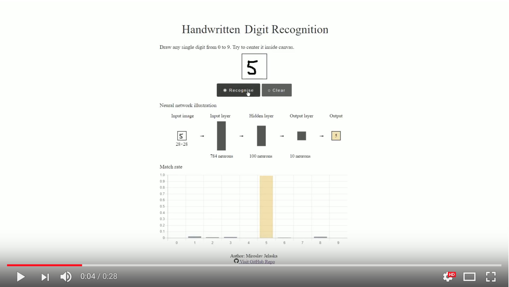

# Handwritten Digit Recognition
Simple handwritten digit recognition. I created this project after reading ["Make Your Own Neural Network" by Tariq Rashid](https://www.amazon.com/Make-Your-Own-Neural-Network/dp/1530826608). Training and testing done in Python, recognition web done in JavaScript.

 

Training and testing data originate from http://makeyourownneuralnetwork.blogspot.hr/2015/03/the-mnist-dataset-of-handwitten-digits.html which is actually MNIST Dataset with 60000 training and 10000 testing examples.

If you would like to know more about ANN these resources could be interesting for you:
* [Neural Network Design (2nd Edition)](https://www.amazon.com/Neural-Network-Design-Martin-Hagan/dp/0971732116)
* [youtube > 3Blue1Brown > Neural networks](https://www.youtube.com/playlist?list=PLZHQObOWTQDNU6R1_67000Dx_ZCJB-3pi)
* [http://neuralnetworksanddeeplearning.com](http://neuralnetworksanddeeplearning.com/)
* [Nolte's The Human Brain: An Introduction to its Functional Anatomy, 7e](https://www.amazon.com/Noltes-Human-Brain-Introduction-Functional/dp/1455728594) - for those interested in a brain itself
* [Khanacademy > Neural cells and neurotransmitters](https://www.khanacademy.org/science/health-and-medicine/nervous-system-and-sensory-infor/neural-cells-and-neurotransmitters/v/neurotransmitter-release) - for those interested in a brain itself
