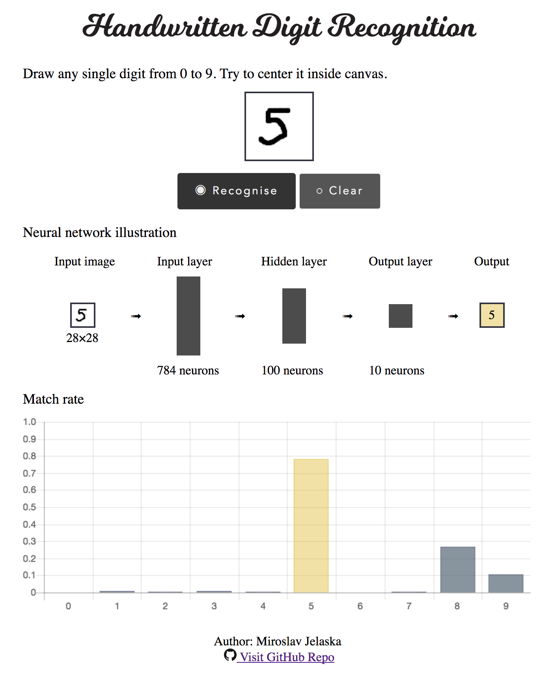

# Handwritten Digit Recognition
Simple handwriting recognition. Training and testing done in Python, recognition web done in JavaScript.

 

Training and testing data originate from: http://makeyourownneuralnetwork.blogspot.hr/2015/03/the-mnist-dataset-of-handwitten-digits.html
